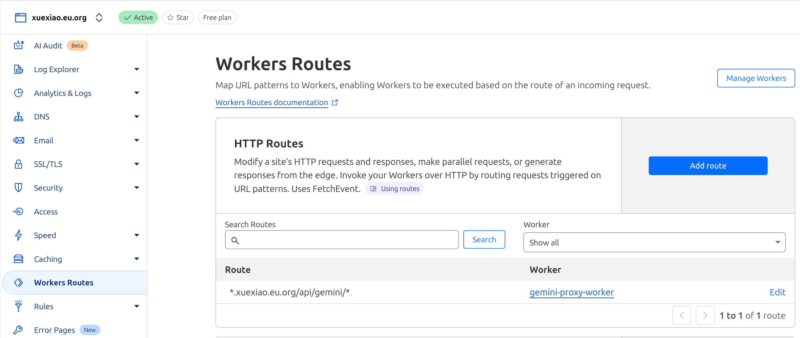

# 🚀 Gemini Chat Application

<div align="center">


**Modern AI Chat Interface · Based on Google Gemini API · 2025 Optimized Version**

*High Performance · Smart Caching · Multimodal Support · Enterprise Security*

</div>

---

## 📖 What is this?

This is a modern AI chat application that provides a clean, fast interface for Google Gemini AI models. It supports text conversations, image uploads, document analysis, and real-time streaming responses with advanced content rendering including charts, tables, and mathematical formulas.

### 🎭 Try Live Demo

**Demo Site**: [https://gemini.xuexiao.eu.org](https://gemini.xuexiao.eu.org) 

> ⚠️ **Demo Only**: This is a trial version for testing purposes. For production use, **we strongly recommend deploying your own instance** to ensure privacy, security, and optimal performance.

## 🚀 Deployment Options

Choose one of the following deployment methods:

### 1. ☁️ Cloudflare Pages (Recommended)

**🎯 Why Cloudflare is the Best Choice:**
- ✅ **Free tier available** with generous limits
- ✅ **Global CDN** for optimal performance worldwide  
- ✅ **Automatic HTTPS** and SSL certificate management
- ✅ **Easy custom domain** setup with professional appearance
- ✅ **Serverless scaling** - handles traffic spikes automatically
- ✅ **One-click deployment** from GitHub

#### 🚀 Deployment Steps

**Step 1: Deploy Gemini App (Frontend)**
[](https://deploy.workers.cloudflare.com/?url=https://github.com/tellerlin/gemini-app)

**Step 2: Deploy Gemini Proxy Worker (API Backend)**  
[](https://deploy.workers.cloudflare.com/?url=https://github.com/tellerlin/gemini-proxy-worker)

**Step 3: Setup Custom Domain for Gemini App**
1. In Cloudflare Dashboard, go to your deployed Pages project
2. Navigate to **Custom domains** tab
3. Click **"Set up a custom domain"**
4. Add `gemini.yourdomain.com` (or your preferred subdomain)
5. Cloudflare will automatically configure DNS and SSL

**Step 4: Configure Worker Routes for API**
1. In Cloudflare Dashboard, select your main domain (`yourdomain.com`)
2. Select **"Workers Routes"** 
3. Click **"Add route"**
4. Set route pattern: `*.yourdomain.com/api/gemini/*`
5. Select your deployed Gemini Proxy Worker
6. Save the configuration



**Step 5: Configure Your App**
1. Open your deployed Gemini App at `https://gemini.yourdomain.com`
2. Click the Settings icon and add your Google AI API keys
3. Your app is ready to use!

**✅ Complete Setup!** Your app will work at `https://gemini.yourdomain.com` with API calls routed through `https://gemini.yourdomain.com/api/gemini/*`

> 💡 **Auto-Configuration**: The app automatically detects it's running in production and switches to proxy mode - no manual environment variable setup needed!

**Benefits of Custom Domain Setup:**
- ✅ Professional appearance with your own branding
- ✅ Same domain for both app and API (no CORS issues)
- ✅ Clean URLs without `.pages.dev` subdomain
- ✅ Better SEO and user trust
- ✅ Unified SSL certificate management

### 2. 📦 Local Development

**System Requirements:**
- Node.js 18+
- Google AI Studio API Key

**Steps:**
```bash
# Clone the repository
git clone https://github.com/tellerlin/gemini-app.git
cd gemini-app

# Install dependencies
npm install

# Start development server
npm run dev

# Open http://localhost:5173
```

**Configuration:**
1. Get API keys from [Google AI Studio](https://makersuite.google.com/app/apikey)
2. Click settings icon in the app to add API keys
3. **Connection Mode**: Choose your API connection method:

**Option A: Auto-detect (Recommended)**
```bash
# No configuration needed - automatically detects:
# Local: Direct connection to Google API
# Production: Uses /api/gemini proxy
npm run dev
```

**Option B: Force Direct Connection**
```bash
# Create .env file
echo "VITE_GEMINI_API_MODE=direct" > .env
npm run dev
```

**Option C: Force Proxy Mode**
```bash
# Create .env file  
echo "VITE_GEMINI_API_MODE=proxy" > .env
npm run dev
```

### 3. 🐳 Docker Deployment

**Quick Start (Direct Connection):**
```bash
docker run -p 80:80 tellerlin/gemini-app
```

**With Docker Compose:**
```bash
git clone https://github.com/tellerlin/gemini-app.git
cd gemini-app
docker-compose up -d
```

**Environment Variables:**
```env
# Force direct connection (recommended for Docker)
VITE_GEMINI_API_MODE=direct

# Or use proxy mode if needed
# VITE_GEMINI_API_MODE=proxy
# VITE_GEMINI_PROXY_URL=https://your-proxy.com/api/gemini
```

## 🔧 Configuration

### 🌐 API Connection Modes

This application supports three connection modes to accommodate different deployment environments:

#### 1. **Auto-detect Mode (Default)**
Automatically chooses the best connection method:
- **Local Development** (`localhost`, `127.0.0.1`, `0.0.0.0`): Direct connection to Google API
- **Production Deployment**: Uses `/api/gemini` proxy endpoint

```env
VITE_GEMINI_API_MODE=auto  # or omit (default behavior)
```

#### 2. **Direct Connection Mode**  
Always connects directly to `generativelanguage.googleapis.com`  
✅ **Best for**: Local development, Docker containers, environments with direct internet access

```env
VITE_GEMINI_API_MODE=direct
```

#### 3. **Proxy Mode**
Always uses `/api/gemini` proxy endpoint  
✅ **Best for**: Cloudflare Workers, Vercel Edge Functions, corporate networks

```env
VITE_GEMINI_API_MODE=proxy
```

#### 4. **Custom Proxy URL**
Use a custom proxy endpoint (overrides all other settings)

```env
VITE_GEMINI_PROXY_URL=https://your-custom-proxy.com/api/gemini
```

### 🔑 API Keys
Get your API keys from [Google AI Studio](https://makersuite.google.com/app/apikey) and configure them either:
- **In-App Settings** (Recommended): Click the settings icon in the app
- **Environment Variables**: Not recommended for production (see [.env.example](.env.example))

### 📁 Environment Setup
Copy `.env.example` to `.env` and configure for your environment:

```bash
cp .env.example .env
# Edit .env with your preferred settings
```

### 🚨 Security Note
**Never put API keys in environment variables for production deployments.** Always use the in-app settings to maintain security and prevent exposure in build artifacts.

## 🎯 Core Features

- **Multi-model Support**: Gemini 2.5 Pro/Flash/Flash-Lite/Live
- **Multimodal Chat**: Text, images, PDFs, and documents
- **Real-time Streaming**: Instant AI responses with typewriter effect
- **Rich Content**: Charts, tables, math formulas, code highlighting
- **Smart Caching**: Optimized performance and memory usage
- **PWA Ready**: Install as desktop/mobile app
- **Secure**: Encrypted API key storage

## 📄 License

MIT License - See [LICENSE](LICENSE) file for details

---

<div align="center">

**🚀 Modern AI Chat Application**

[⭐ Star on GitHub](https://github.com/tellerlin/gemini-app) · 
[🐛 Report Issue](https://github.com/tellerlin/gemini-app/issues) · 
[💬 Discussions](https://github.com/tellerlin/gemini-app/discussions)

*Requires [Gemini Proxy Worker](https://github.com/tellerlin/gemini-proxy-worker) for production deployment*

</div>
