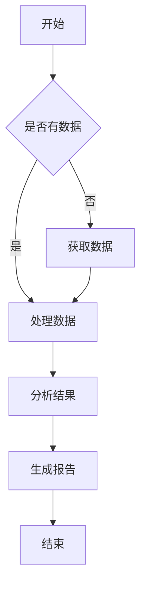

# 渲染系统测试内容

测试复杂的数学公式和Mermaid图表渲染。

## 数学公式测试

### 内联数学
这是一个内联数学公式: $E = mc^2$，还有一个更复杂的: $\int_{-\infty}^{\infty} e^{-x^2} dx = \sqrt{\pi}$

### 块级数学
这是一个复杂的数学公式：

$$
\frac{\partial}{\partial t} \left[ \int_{\Omega} \left( \nabla \cdot \left( \mathbf{A}(x,t) \times \frac{\partial \mathbf{B}(x,t)}{\partial t} \right) + \lambda \left| \mathcal{F}^{-1} \left\{ \exp\left( -\frac{i}{\hbar} \int_{-\infty}^{t} V(\tau) d\tau \right) \cdot \hat{Q} \left[ \mathbf{C}(k, \omega) \right] \right\} \right|^2 \right) d^3x \right]
$$

另一个数学公式：

$$
\sum_{n=1}^{\infty} \frac{1}{n^2} = \frac{\pi^2}{6}
$$

## Mermaid图表测试



## 代码测试

```python
def calculate_fibonacci(n):
    """计算斐波那契数列的第n项"""
    if n <= 1:
        return n
    return calculate_fibonacci(n-1) + calculate_fibonacci(n-2)

# 测试
for i in range(10):
    print(f"F({i}) = {calculate_fibonacci(i)}")
```

## 表格测试

| 功能 | 旧系统 | 新系统 |
|------|--------|--------|
| 数学渲染 | ❌ | ✅ |
| Mermaid | 🔄 | ✅ |
| 代码高亮 | ✅ | ✅ |
| 错误处理 | ❌ | ✅ |
| 导出支持 | ❌ | ✅ |