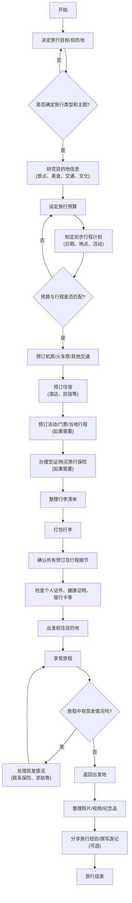

# 旅行规划流程图

```mermaid
graph TD
    A["开始"] --> B["决定旅行目标/目的地"]
    B --> C{"是否确定旅行类型和主题?"}
    C -->|是| D["研究目的地信息<br/>(景点、美食、交通、文化)"]
    C -->|否| B
    D --> E["设定旅行预算"]
    E --> F["制定初步行程计划<br/>(日期、地点、活动)"]
    F --> G{"预算与行程是否匹配?"}
    G -->|否| E
    G -->|是| H["预订机票/火车票/其他交通"]
    H --> I["预订住宿<br/>(酒店、民宿等)"]
    I --> J["预订活动/门票/当地行程<br/>(如果需要)"]
    J --> K["办理签证/购买旅行保险<br/>(如果需要)"]
    K --> L["整理行李清单"]
    L --> M["打包行李"]
    M --> N["确认所有预订及行程细节"]
    N --> O["检查个人证件、健康证明、银行卡等"]
    O --> P["出发前往目的地"]
    P --> Q["享受旅程"]
    Q --> R{"旅程中有突发情况吗?"}
    R -->|是| S["处理突发情况<br/>(联系保险、求助等)"]
    S --> Q
    R -->|否| T["返回出发地"]
    T --> U["整理照片/视频/纪念品"]
    U --> V["分享旅行经验/撰写游记<br/>(可选)"]
    V --> W["旅行结束"]
```